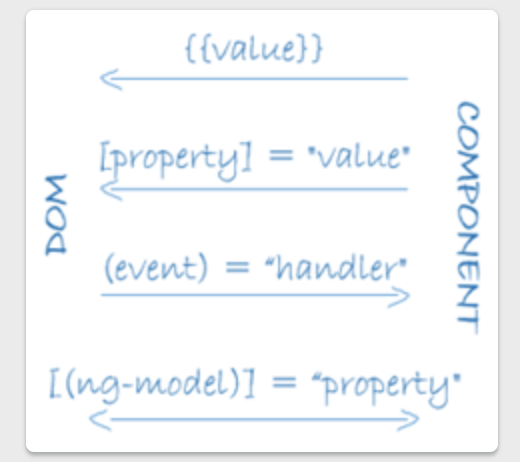
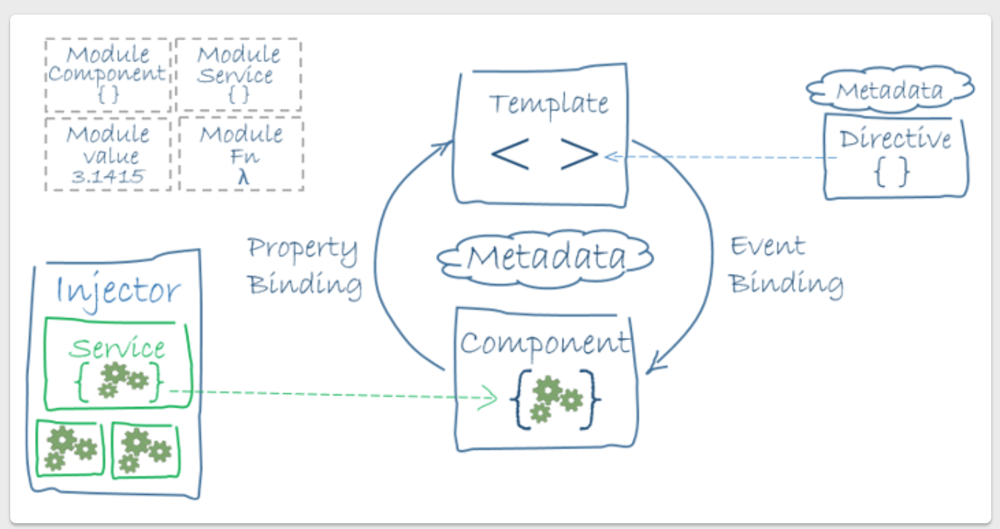

# Angular 개요

Angular는 HTML과 TypeScript로 클라이언트 애플리케이션을 개발할 때 사용하는 플랫폼이자 프레임워크이다.

## Module
- 컴포넌트의 묶음: 비슷한 기능을 하나로 묶어서 관리하기 위한 모듈(컴포넌트나 서비스, 폼 등을 모두 포함)
- @NgModule() 데코레이터: 모듈을 정의하는 메타데이터를 전달하면서 실행한다.
- 애플리케이션은 부트스트랩을 하기 위해 최상위 모듈을 꼭 가진다. (`AppModule`)
```typescript
platformBrowserDynamic().bootstrapModule(AppModule)
  .catch(err => console.error(err));
```
- JS와 마찬가지로 일부 기능을 모듈 외부로 공개할 수 있다. (export)
- `lazyloading`에 유리하다.

### 메타데이터
```typescript
import { NgModule }      from '@angular/core';
import { BrowserModule } from '@angular/platform-browser';
@NgModule({
  imports:      [ BrowserModule ],
  providers:    [ Logger ], 
  declarations: [ AppComponent ], 
  exports:      [ AppComponent ], 
  bootstrap:    [ AppComponent ] 
})
export class AppModule { }
``` 
- imports: 사용할 다른 모듈
- providers:  안에서 사용하는 서비스 프로바이더를 지정. => 의존성 주입에 꼭 있어야하던가? 없어도되던데.. 주입을 안하고 쓸 수있진 않을텐데.
- declarations: 컴포넌트, 디렉티브, 파이프를 선언
- exports: 모듈의 구성요소를 외부로 공개. 사실 최상위 모듈에서는 지정할 필요 없다.
- bootstrap: 애플리케이션의 최상위 뷰로 표시될 최상위 컴포넌트를 지정. bootstrap 프로퍼티는 최상위 NgModule 에만 지정할 수있다.

### NgModule과 컴포넌트
- 컴포넌트가 *컴파일되는 시점이 컨텍스트를 제공*한다.
- 컴포넌트를 정의할 때에는 **호스트뷰**와 연결된다. 호스트뷰는 컴포넌트에 연결된 뷰들 중 최상위 뷰이다.

## 앵귤러 라이브러리
- 앵귤러 프레임워크는 js 모듈 형태(라이브러리)로 제공된다.
- 각각의 라이브러리는 @angular 접두사로 시작한다. (`import { Component } from '@angular/core';`)
- 

## Component
- 클래스(데이터와 로직 처리)와 템플릿(HTML 뷰)으로 구성된다.
- 컴포넌트 클래스에 @Component() 데코레이터, 메타데이터에 뷰를 함께 지정한다.
```
@Component({
  selector: 'app-root',
  templateUrl: './app.component.html', 
  styleUrls: ['./app.component.scss']
})

export class AppComponent {
  title = 'my-app';
}
```
- 라이프사이클 후킹함수를 이용해서 각 시점에서 필요한 동작을 실행할 수 있다.

### 컴포넌트 메타데이터
- @Component 데코레이터를 붙이기 전까지 이 클래스는 컴포넌트로 등록되지도 않는다.
```typescript
@Component({
  // 
  selector:    'app-hero-list',
  templateUrl: './hero-list.component.html',
  providers:  [ HeroService ]
})
export class HeroListComponent implements OnInit {
/* . . . */
}
```
- selector: 돔에서 이 컴포넌트의 위치를 결정한다. `<app-hero-list></app-hero-list>`라고 작성한 위치에 HeroListComponent의 인스턴스가 생성된다.
- templateUrl: 컴포넌트의 호스트뷰를 지정한다.
- providers: 의존석으로 주입되는 서비스를 지정

### 템플릿 문법
#### 데이터 바인딩
템플릿과 뷰를 연결


- 문자열 바인딩. **컴포넌트의 `hero.name`의 값**을 텍스트로 표시.
```html
<li>{{hero.name}}</li>
```
- 프로퍼티 바인딩. **컴포넌트의 `selectedHero`의 값**을 hero프로퍼티에 전달한다.
```html
<app-hero-detail [hero]="selectedHero"></app-hero-detail>
``` 
- 이벤트 바인딩. `click` 이벤트가 발생하면 **컴포넌트의 selectHero(hero) 메소드**가 실행된다.
```html
<li (click)="selectHero(hero)"></li>
```


## 템플릿, 디렉티브, 데이터 바인딩
- 템플릿: HTML문법 + Angular마크업
- 디렉티브: 원하는 동작을 하도록 확장
- 데이터 바인딩: 뷰를 돔과 연결(이벤트 바인딩, 프로퍼티 바인딩)
앵귤러는 *뷰가 화면에 표시되기 전에* 디렉티브와 바인딩 문법을 체크해서 돔에 반영한다.
앵귤러는 양방향 바인딩을 지원한다.

## 서비스, 의존성 주의(Dependency injection, DI)
- @Inejctable 데코레이터: 컴포넌트나 다른 서비스에 의존성으로 주입하기 위해 **다른 구성요소보다 먼저 처리**된다.
- 뷰와 직접적인 관련이 없는 로직(http통신 등)은 서비스로 분리하여 작성하고 의존성 주입을 통해 사용한다.

## 라우팅
- Router NgModule: url을 사용해서 애플리케이션 상태를 전환할 수 있다. 
- 페이지 대신 뷰를 url과 매핑하는 방식이다. -> 싱글 페이지 웹이라서 실제로 새로고침되는 것은 아니고 url에 맞게 화면 내용(상태)을 바꿔주는 것이다.

